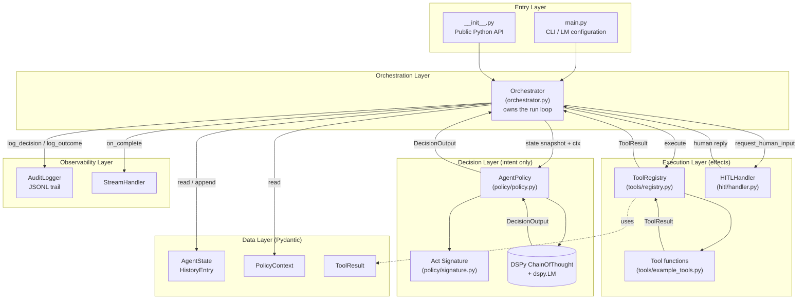
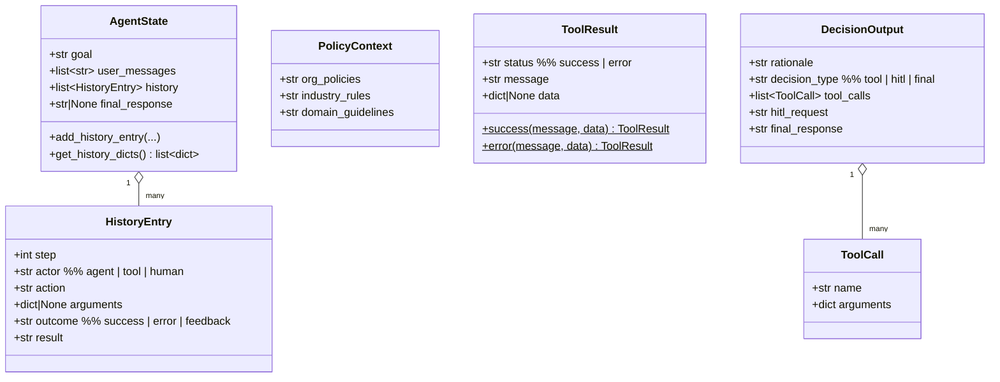
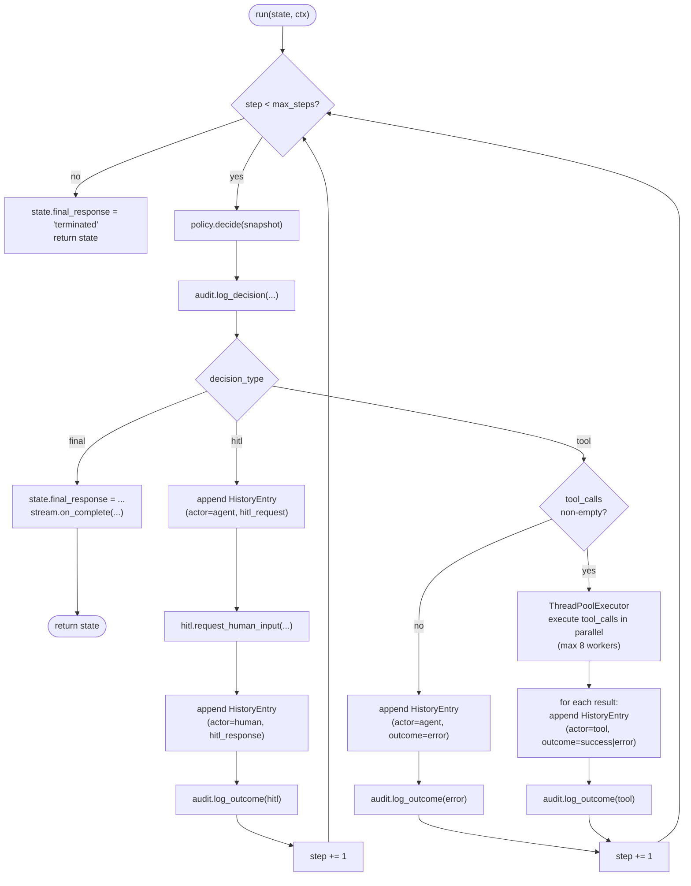
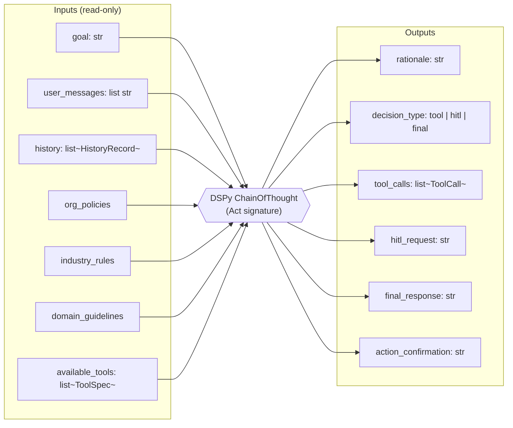
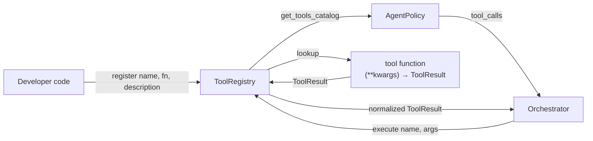
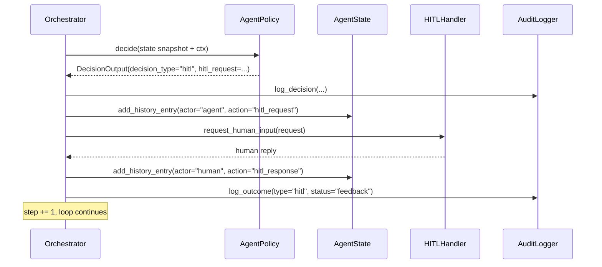
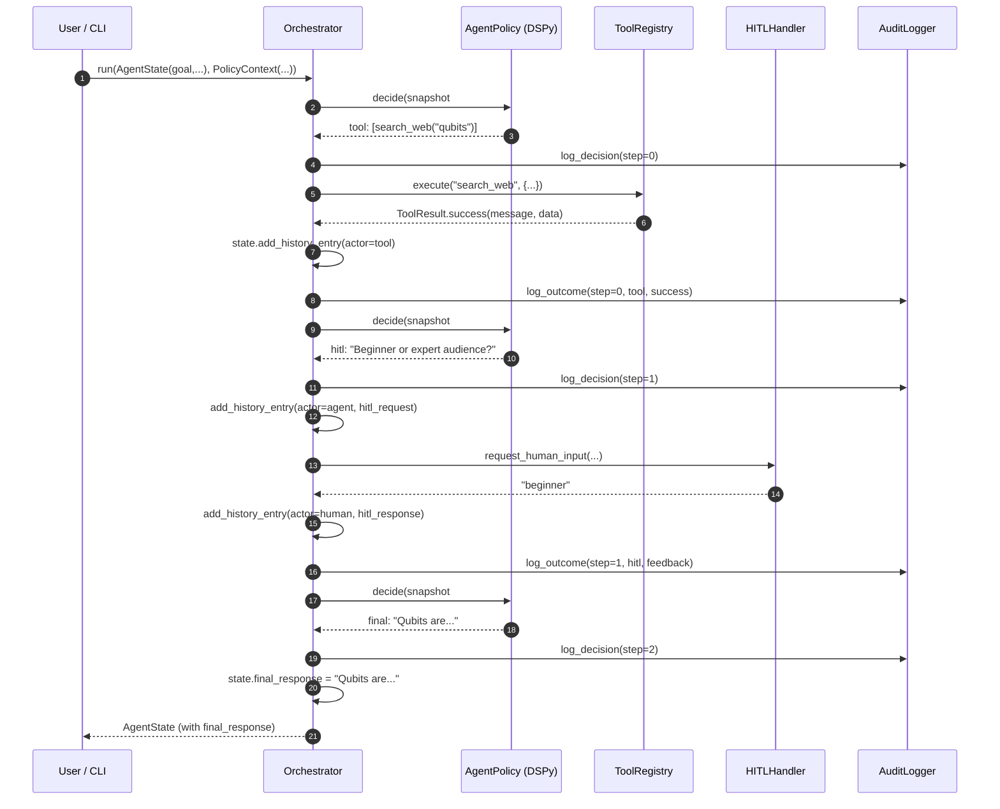

# Architecture

This document explains how `agent-loop` is structured: the layers, the data
that flows between them, and the lifecycle of a single agent run. It is aimed
at developers who want to extend the framework, integrate it into a larger
system, or simply understand how a "DSPy-driven decision loop" actually works.

## 1. What This System Is

`agent-loop` is a **deterministic, auditable agentic loop**. The defining idea
is a strict separation between two concerns:

| Concern               | Owner             | Notes                                            |
| --------------------- | ----------------- | ------------------------------------------------ |
| **Decision (intent)** | DSPy policy (LLM) | Pure function: input snapshot &rarr; decision   |
| **Execution (effect)**| Orchestrator      | Mutates state, runs tools, persists audit log    |

The LLM never executes anything; it only produces a typed *decision* describing
what should happen next. The orchestrator interprets that decision against the
real world. This separation is what makes runs replayable and auditable.

This is a **decision system, not a chatbot**. Each loop iteration produces one
of three outcomes: invoke tool(s), ask a human, or finalize.

## 2. Layered Architecture



**Key invariant:** arrows into the Decision Layer carry only *snapshots* of
state. The policy never holds a reference to mutable state and never produces
side effects.

## 3. Module Map

| Path                                          | Role                                             |
| --------------------------------------------- | ------------------------------------------------ |
| `src/agent_loop/main.py`                      | CLI, argparse, `dspy.LM` configuration           |
| `src/agent_loop/__init__.py`                  | Public API: `Orchestrator`, `AgentState`, `PolicyContext`, `ToolResult`, `HistoryEntry` |
| `src/agent_loop/orchestrator.py`              | Run loop, state mutation, tool dispatch, audit calls |
| `src/agent_loop/policy/signature.py`          | DSPy `Act` signature &mdash; the contract with the LLM |
| `src/agent_loop/policy/policy.py`             | `AgentPolicy.decide()`, `DecisionOutput` normalization |
| `src/agent_loop/models/state.py`              | `AgentState`, `HistoryEntry` (append-only history) |
| `src/agent_loop/models/policy_context.py`     | `PolicyContext` (org / industry / domain rules)  |
| `src/agent_loop/models/tool_result.py`        | `ToolResult` with `.success()` / `.error()` factories |
| `src/agent_loop/tools/registry.py`            | `ToolRegistry`: register, list, execute (normalizes errors) |
| `src/agent_loop/tools/example_tools.py`       | Reference tools + `create_default_registry()`    |
| `src/agent_loop/hitl/handler.py`              | `HITLHandler` ABC + Console / Callback / Async impls |
| `src/agent_loop/audit/logger.py`              | `AuditEntry`, `AuditLogger` (in-memory + JSONL)  |
| `src/agent_loop/streaming/streamer.py`        | `StreamHandler` ABC + Console / Buffered / Null  |

## 4. Domain Model



The boundary between layers is enforced by these Pydantic models. The policy
receives `AgentState` + `PolicyContext` and returns a `DecisionOutput`; the
orchestrator turns tool executions into `ToolResult` and appends
`HistoryEntry` objects. Nothing else crosses the boundary.

## 5. The Run Loop

The heart of the system is `Orchestrator.run(state, policy_context)`. Each
iteration is a *Decide &rarr; Dispatch &rarr; Mutate &rarr; Audit* cycle.



**Notes on the loop**

- Tool calls run inside a `ThreadPoolExecutor` (`max_workers = min(len(calls), 8)`).
  Result order matches call order via `zip`.
- `step` is incremented for `tool` and `hitl` decisions but **not** for `final`
  (the loop exits immediately).
- A `tool` decision with an empty `tool_calls` list is treated as a recoverable
  error: an error `HistoryEntry` is appended so the next decision can react.
- All tool exceptions are caught inside `ToolRegistry.execute` and converted
  into `ToolResult.error(...)`. Exceptions never escape the loop.

## 6. The Decision Contract (DSPy `Act` Signature)

The LLM's job is fully described by a single DSPy signature in
`policy/signature.py`. The orchestrator hands the policy a state snapshot
plus the policy context; the policy returns a `DecisionOutput`.



`AgentPolicy.decide()` then **normalizes** the raw DSPy output:

- Coerces `tool_calls` from JSON string / dict-wrapped forms into a clean
  `list[ToolCall]`. Malformed entries are dropped.
- Lower-cases `decision_type` and falls back to `"final"` when invalid.
- Clears `tool_calls` if `decision_type != "tool"` so downstream code can
  trust the invariant.

This normalization layer is what allows the orchestrator to assume a
well-formed `DecisionOutput`.

## 7. Tools as Plugins



`ToolRegistry.execute` is the single funnel that:

1. Resolves the tool by name (missing tool &rarr; `ToolResult.error`).
2. Calls it with the arguments dict (`TypeError` &rarr; `ToolResult.error("Invalid arguments...")`).
3. Catches any other exception (&rarr; `ToolResult.error("Tool failed...")`).
4. Wraps non-`ToolResult` returns with `ToolResult.success(str(value))`.

So every tool invocation becomes a uniform `ToolResult`, which is what gets
serialized into the history and the audit log.

## 8. Human-in-the-Loop

HITL is a **first-class decision type**, not a special case. When the policy
returns `decision_type == "hitl"`, the orchestrator:

1. Appends an `agent` history entry with the HITL question.
2. Calls `HITLHandler.request_human_input(request)`.
3. Appends a `human` history entry with the response.
4. Continues the loop &mdash; the next decision sees the answer in history.



Three handlers ship in `hitl/handler.py`:

- **`ConsoleHITLHandler`** &ndash; blocking Rich prompt for CLI use.
- **`CallbackHITLHandler`** &ndash; wraps any `Callable[[str], str]` for embedding
  in a host application.
- **`AsyncHITLHandler`** &ndash; raises `HITLPendingError` to suspend the run
  (designed for workflow engines like Temporal or Step Functions); a later
  call to `provide_response()` resumes execution.

## 9. Audit Trail

`AuditLogger` writes one JSONL file per session (`session_<id>.jsonl`) and
also keeps everything in memory. Each `AuditEntry` captures:

- `step`, `timestamp`
- `input_snapshot` &ndash; goal, history length, policy context fields
- `decision_output` &ndash; decision type, rationale, decision details
- `outcome` &ndash; tool/HITL result, status, data (filled in after execution)

The orchestrator calls `log_decision(...)` immediately after the policy
returns, then `log_outcome(...)` after the dispatch completes. Together they
make every iteration reconstructable.

`AuditLogger.load_session(path)` rehydrates a logger from a JSONL file, which
is the foundation for replay and regression testing.

## 10. Streaming

Streaming is intentionally orthogonal to reasoning &mdash; it's a transport
concern. `StreamHandler` is an ABC with `on_token(str)` and
`on_complete(str)` hooks. Three implementations exist (`Console`, `Buffered`,
`Null`); the orchestrator currently calls only `on_complete(final_response)`
when a run finishes. Token-level streaming during reasoning is a planned
extension point.

## 11. End-to-End Example

A typical research-style run, showing the loop dispatching across all three
decision types:



## 12. Design Properties That Fall Out

| Property              | How it is achieved                                                       |
| --------------------- | ------------------------------------------------------------------------ |
| **Determinism**       | Policy is a pure function of an explicit snapshot; no hidden state.      |
| **Replayability**     | `AuditLogger` records the input snapshot and decision per step.          |
| **Auditability**      | Every decision and outcome is appended to a JSONL trail.                 |
| **Extensibility**     | Tools, HITL handlers, and stream handlers are pluggable interfaces.      |
| **Robustness**        | All tool errors funnel into `ToolResult.error`; the loop never throws.   |
| **Testability**       | Scripted policies + isolated tool registries cover every code path.     |

## 13. Extension Points

| You want to&hellip;                                  | Do this                                                            |
| ----------------------------------------------- | ------------------------------------------------------------------ |
| Add a new tool                                  | Implement `(**kwargs) -> ToolResult` and call `registry.register(name, fn, description)`. |
| Integrate a web UI for HITL                     | Implement `HITLHandler.request_human_input` (often via `CallbackHITLHandler`). |
| Suspend / resume across a workflow engine       | Use `AsyncHITLHandler` and catch `HITLPendingError`.               |
| Push tokens to a websocket                      | Implement a custom `StreamHandler`.                                |
| Persist audit data to a database                | Subclass `AuditLogger` and override the persistence path.          |
| Swap the reasoning strategy                     | Replace `dspy.ChainOfThought(Act)` inside `AgentPolicy` (e.g., with `ReAct` or a compiled program). |
| Change LLM provider                             | Use `--provider` / `--model` on the CLI, or call `dspy.configure(lm=...)` before constructing `Orchestrator`. |

## 14. Public API in One Glance

```python
from agent_loop import Orchestrator, AgentState, PolicyContext

state = AgentState(
    goal="Research quantum computing",
    user_messages=["Tell me about qubits"],
)
ctx = PolicyContext(org_policies="Be helpful and accurate")

result = Orchestrator().run(state, ctx)
print(result.final_response)
```

That single call drives the loop from Section 5, mediated by the contract in
Section 6, with the observability described in Sections 9 and 10.
